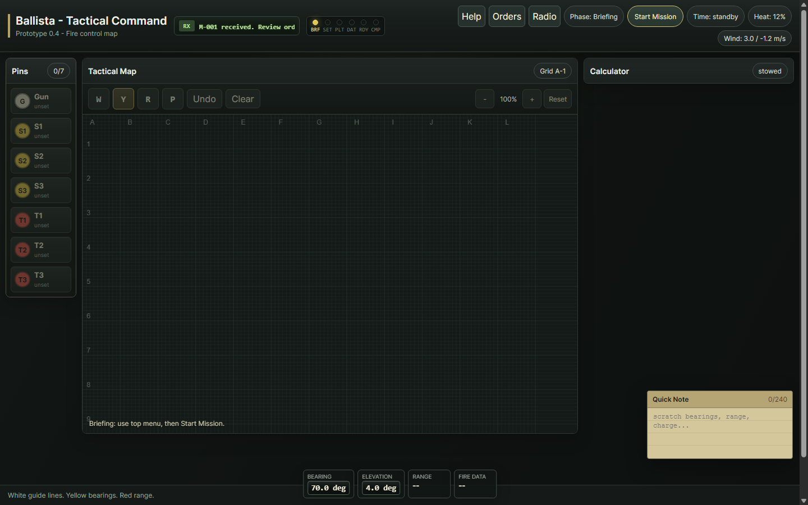
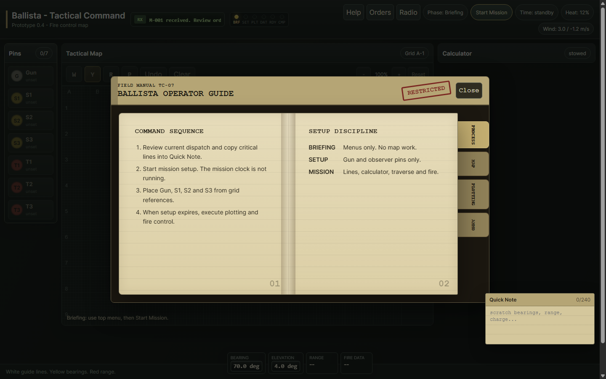
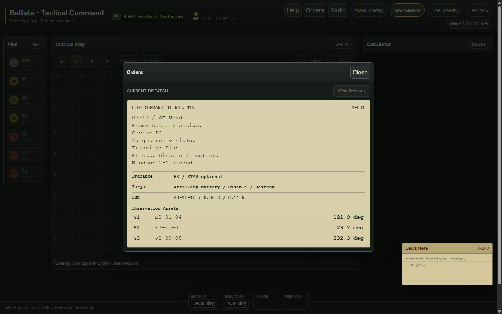
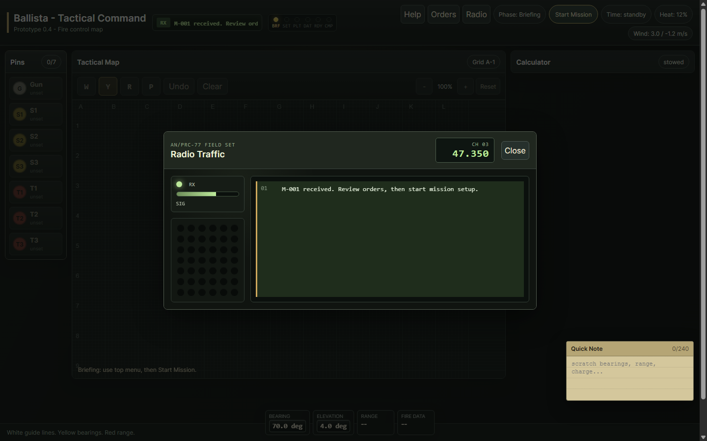

# Ballista - Tactical Command

**Ballista - Tactical Command** is a tactical artillery command prototype about reading orders, plotting bearings, calculating fire data, and operating a heavy gun under time pressure.

The game is built as a browser-based interface with a minimalist tactical map, radio traffic, paper-style orders, operator notes, setup phases, and manual fire-control workflow.

## Play

For non-technical users:

1. Double-click `setup.bat` once.
2. Double-click `start.bat`.
3. The game opens at `http://127.0.0.1:5173/`.
4. Double-click `stop.bat` when finished.

See [START_HERE.md](START_HERE.md) for the shortest setup instructions.

## Developer Commands

```bash
npm install
npm run start
npm run build
```

## Current Prototype Features

- Briefing phase with locked controls
- 10-minute setup phase for placing Gun and Spotter pins
- Tactical map with zoom, pan, major grid, and 10x10 subgrids
- Orders modal with field-manual styled dispatches
- Radio ticker and radio console
- Quick Notes panel with clickable order-to-note entries
- Manual bearing/range plotting using white, yellow, and red line tools
- Ballistic calculator with ammunition and charge selection
- Heavy-gun traverse/load/ready-check flow
- Projectile flight visualization and mission result evaluation

## Screenshots

### Tactical Overview



### Operator Guidebook



### Orders



### Radio Console



## License

This project is licensed under the MIT License. See [LICENSE](LICENSE).
